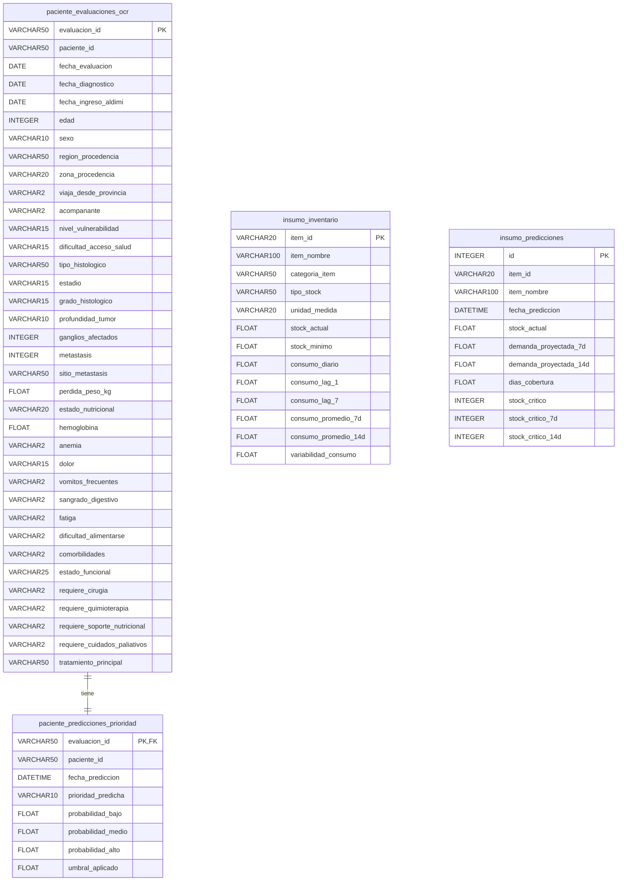

# Documentación Técnica - Hito 4: Ecosistema ALDIMI-Predict (Fase 6 de CRISP-DM)

Este documento detalla la implementación final del **Ecosistema ALDIMI-Predict** correspondiente al Hito 4 del proyecto. Integra el flujo completo de datos clínicos de pacientes con el control logístico de inventario de medicamentos oncológicos, proporcionando un entorno automatizado (MLOps) y una interfaz de usuario interactiva para la toma de decisiones directivas.

---

## 1. Arquitectura General del Ecosistema

El ecosistema se diseñó bajo una arquitectura modular y orientada a objetos en Python, estructurada de la siguiente manera:

```
Aldimi-Project/
│
├── data/                               # Conjuntos de datos y SQLite
│   ├── aldimi_shared.db                # Base de datos SQLite unificada
│   ├── evaluaciones_pacientes_...csv   # Datos clínicos históricos
│   └── insumos_cancer_final.csv        # Series temporales históricas de stock
│
├── documents/                          # Documentación técnica del proyecto
│   └── Hito4_documentacion.md          # Esta documentación
│
├── src/
│   ├── config.py                       # Parámetros y rutas globales
│   ├── database/
│   │   ├── connection.py               # Configuración de conexiones ORM
│   │   ├── models.py                   # Esquema de tablas SQLAlchemy
│   │   └── initialize_data.py          # Bootstrapping y seeding de datos
│   │
│   ├── models/
│   │   └── saved_models/               # Pickles de modelos optimizados
│   │       ├── best_model_classification.pkl
│   │       ├── best_model_regression_7d.pkl
│   │       └── best_model_regression_14d.pkl
│   │
│   ├── pipeline/
│   │   └── data_pipeline.py            # Pipeline secuencial de inferencia
│   │
│   └── app.py                          # Dashboard Streamlit
│
└── tests/
    ├── test_integration.py             # Pruebas de base de datos
    └── test_pipeline.py                # Pruebas del pipeline completo
```

---

## 2. Pipeline de Datos e Inferencia (MLOps)

El pipeline implementado en `src/pipeline/data_pipeline.py` implementa la clase `AldimiPipeline` y realiza el procesamiento secuencial cuando ingresa un nuevo paciente:

### Paso 2.1: Validación de Datos (Pre-ingesta)
Aplica reglas estrictas para garantizar la calidad del dato clínico:
1. **Validación Cronológica**: Comprueba que la `fecha_evaluacion` sea posterior o igual a la `fecha_diagnostico` y `fecha_ingreso_aldimi`.
2. **Control de Rango de Edad**: Valida que la edad del paciente esté dentro del rango `[0 - 120]`.
3. **Control de Rango de Hemoglobina**: Verifica que los niveles de hemoglobina estén dentro de `[3.0 - 25.0]` g/dL; de lo contrario, imputa con la mediana de seguridad (`12.0`).
4. **Limpieza Categórica**: Limpia espacios en blanco y convierte todas las variables string a minúsculas.

### Paso 2.2: Preprocesamiento y Feature Engineering
Integra las transformaciones de las etapas **DP-01 a DP-09**:
* Mapeo de variables binarias (`si` -> `1`, `no` -> `0`).
* Mapeo de variables ordinales (estadio, grado histológico, dolor, fatiga, estado nutricional, etc.).
* Creación de variables clínicas derivadas:
  * `indice_avance_oncologico` = estadio + profundidad_tumor + metástasis * 2 + ganglios_afectados
  * `enfermedad_avanzada` = 1 si estadio >= 3 o metástasis == 1 o profundidad_tumor >= 4.
  * `indice_deterioro_nutricional` = estado_nutricional + dificultad_alimentarse + perdida_peso_alta + requiere_soporte_nutricional.
  * `conteo_sintomas_relevantes` = dolor_alto + fatiga_alta + vomitos + sangrado + dificultad_alimentarse + anemia.

### Paso 2.3: Inferencia de Prioridad (Modelo 1)
Evalúa el registro del paciente mediante un clasificador **Random Forest** cargando `best_model_classification.pkl`. Aplica el umbral calibrado de **`0.59`** para la clase "Alta prioridad" para cumplir con la restricción de negocio de un **Recall >= 0.85** (minimizando los falsos negativos de pacientes de alta prioridad). 

El registro del paciente se almacena en la tabla `paciente_evaluaciones_ocr` y el resultado de la inferencia se inserta en `paciente_predicciones_prioridad`.

### Paso 2.4: Recálculo del Censo de Albergue
Tras guardar al paciente, el sistema actualiza de forma automática el censo de pacientes activos en el albergue, recalculando métricas del censo:
* Ocupación total, ocupación alta, y el ratio de pacientes de alta prioridad.
* Cantidad de pacientes agrupados por severidad (anemia, desnutrición, dolor alto, etc.).
* **Estimación de Esquemas Quimioterapéuticos**:
  * `pacientes_flot_estimado`: Pacientes que requieren quimioterapia, están en estadio II o III, son candidatos a cirugía y son menores de 75 años.
  * `pacientes_folfox_capox_estimado`: Pacientes que requieren quimioterapia, están en estadio avanzado (III o IV) o metástasis activa.
  * `pacientes_her2_positivo_estimado`: Proporción aproximada del 16% de los pacientes en quimioterapia avanzada (estimación determinista y estable usando un hash de su ID de paciente).

### Paso 2.5: Inferencia de Demanda de Insumos (Modelo 2)
Para cada uno de los 15 insumos críticos, el pipeline construye un vector de **87 características** (que incluye el censo de pacientes, la fecha de proyección y el stock actual del insumo) y ejecuta secuencialmente los modelos **XGBoost Regressor** (`best_model_regression_7d.pkl` y `14d.pkl`).
* **Protección de Negativos**: Se implementa un recorte por código (`max(0.0, pred)`) que previene que los modelos proyecten demandas o consumos negativos en situaciones atípicas.
* **Alertas de Stock Crítico**: Si el stock actual del medicamento es menor que la demanda proyectada, el sistema cambia la variable `stock_critico` a **SÍ (1)**.

---

## 3. Esquema de Base de Datos Expandido (SQL)

La base de datos SQLite unificada (`aldimi_shared.db`) contiene 4 tablas definidas a través del ORM de SQLAlchemy en `src/database/models.py`:



---

## 4. Bootstrapping y Seeding de Datos

Para que el ecosistema se encuentre en un estado de simulación realista e interactivo desde el primer inicio, se desarrolló el script `src/database/initialize_data.py`. Este script:
1. Crea todas las tablas en la base de datos si no existen.
2. Carga los últimos niveles de inventario registrados al **10 de Febrero de 2026** (fecha de cierre de la serie histórica) desde `insumos_cancer_final.csv` en la tabla `insumo_inventario`.
3. Carga las últimas 100 evaluaciones de pacientes antes de dicha fecha desde `evaluaciones_pacientes_cancer_gastrico_sintetico.csv` en la tabla `paciente_evaluaciones_ocr`.
4. Ejecuta automáticamente la inferencia de prioridad del Modelo 1 para estos 100 pacientes y calcula los censo iniciales, dejando la base de datos lista para su uso.

---

## 5. Dashboard de Visualización (Streamlit)

La aplicación web construida en `src/app.py` presenta 3 vistas principales orientadas a la toma de decisiones directivas:

### Vista 5.1: Panel de Gestión de Pacientes
* **Ingreso del OCR**: Un formulario completo donde el personal del albergue ingresa de manera manual o simulada las variables de un paciente extraídas por el módulo OCR.
* **Predicción Instantánea**: Al enviar el formulario, el pipeline se ejecuta en tiempo real y el dashboard despliega una tarjeta de alerta con código de color indicando la prioridad asignada:
  * **Verde (Bajo)**
  * **Naranja (Medio)**
  * **Rojo (Alto)**
* **Tabla de Censo Activo**: Muestra la lista de los pacientes actualmente registrados en el censo con su prioridad asignada.

### Vista 5.2: Panel Logístico y de Inventario
* **Selector de Medicamentos**: Permite navegar entre los 15 insumos clínicos críticos (ej. fluorouracilo, trastuzumab, suplemento nutricional, etc.).
* **Ficha Técnica**: Muestra métricas clave como el stock actual, consumo diario promedio, y las proyecciones de demanda calculadas para 7 y 14 días.
* **Gráfico Plotly interactivo**: Muestra el consumo diario y los niveles de stock históricos, y dibuja las proyecciones futuras estimadas por el Modelo 2 conectadas al final de la serie de tiempo.

### Vista 5.3: Módulo de Alertas de Stock Crítico
* **Alertas Explícitas**: Lista los medicamentos específicos que tienen peligro de desabastecimiento en el horizonte de compra de 7 o 14 días.
* **Semáforo de Cobertura**: Calcula los Días de Cobertura (`stock_actual / consumo_diario`) y asigna un color semafórico:
  * **Rojo (Crítico)**: Cobertura menor a 7 días.
  * **Naranja (Riesgo)**: Cobertura entre 7 y 14 días.
  * **Verde (Seguro)**: Cobertura mayor o igual a 14 días.
* **Filtros Interactivos**: Permite filtrar la tabla general de inventario según el estado semafórico para planificar compras o solicitudes de donación urgentes.

---

## 6. Plan de Verificación y Calidad

### Pruebas Automatizadas
Se implementaron y validaron 2 conjuntos de pruebas usando la biblioteca `unittest` de Python:
* **`tests/test_integration.py`**: Valida las operaciones básicas de lectura, escritura e integridad referencial (llaves foráneas) en SQLite.
* **`tests/test_pipeline.py`**: Prueba el flujo completo de `AldimiPipeline`, incluyendo las reglas de validación pre-ingesta (fechas incorrectas, edad fuera de límites y hemoglobina atípica) y las proyecciones no negativas.

Para ejecutar todas las pruebas de forma unificada:
```bash
python3 -m unittest tests/test_integration.py tests/test_pipeline.py
```
**Resultado**:
```
Ran 6 tests in 1.182s
OK
```
